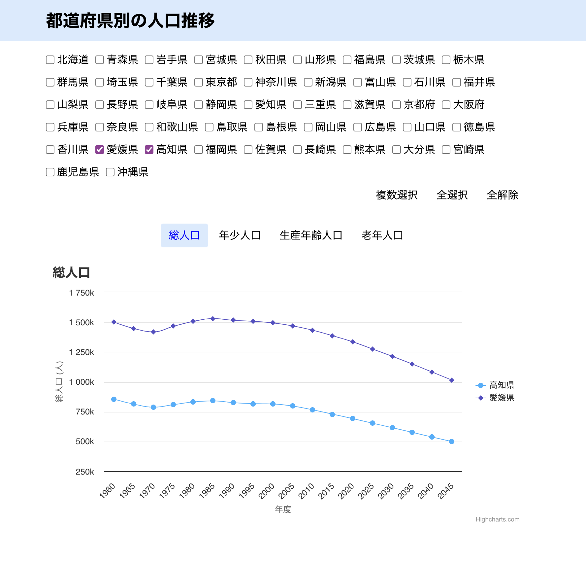
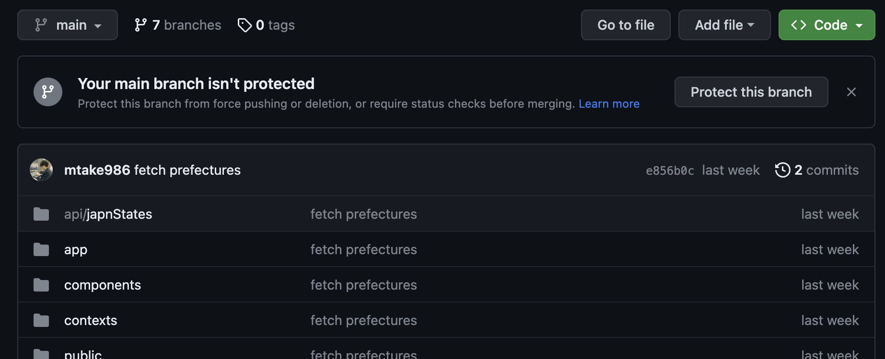
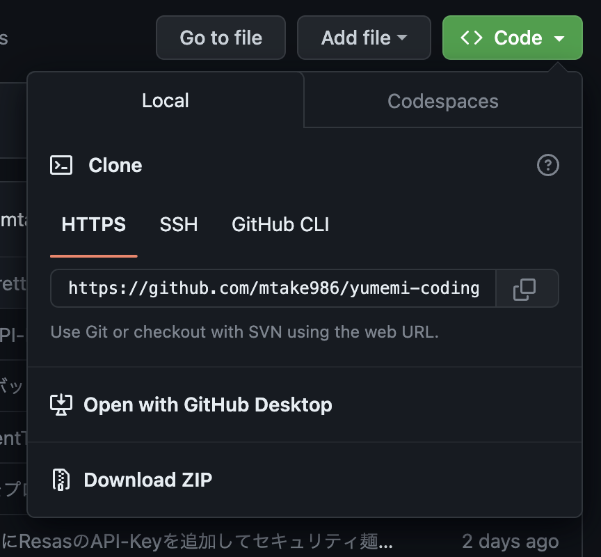

## 使用技術一覧

  
  

## 目次

1. [プロジェクトについて](#プロジェクトについて)
2. [環境](#環境)
3. [動作確認](#動作確認)
4. [環境変数の一覧](#環境変数の一覧)
5. [参考文献](#参考文献)
6. [コーディングテスト概要](#コーディングテスト概要)

## プロジェクト名

都道府県別の人口推移
[URL](https://jpn-population-graph-range-1960-2045.vercel.app/)

## プロジェクトについて

1960~2045年の間の各都道府県の人口推移をグラフで表示するアプリです。各都道府県にチェックマークをいれることで、その都道府県の人口の増減を一目で把握することができます。総人口だけでなく、その都道府県の年少人口・生産年齢人口・老年人口も画面中央のボタンで切り替えれます。

具体的なアプリ画面↓

### 環境

<!-- 言語、フレームワーク、ミドルウェア、インフラの一覧とバージョンを記載 -->

| 言語・フレームワーク      | バージョン   |
| --------------------- | ---------- |
| React                 | 18.2.0     |
| Next.js               | 13.4.10    |
| typescript            | 5.2.2      |

その他のパッケージのバージョンは package.json を参照してください。

### 動作確認

[Node.js](https://nodejs.org/en)が必須です。

1. [レポジトリ](https://github.com/mtake986/yumemi-coding-test)にアクセスして、画面右上の緑色の`<>Code`ボタンをクリック。

参考画像↓

2. `Download ZIP`をクリックして、zipファイルをダウンロード。
もしくは、自身PCのターミナル（コマンドライン）にて`git clone HTTPSの下に表示されてる(https://github...)をコピペ`でクローンする。

参考画像↓

3. フォルダーに移動し、ターミナルで `npm i`を打ち、Enter。さらに`npm run dev` と打ち、Enter。
4. ターミナルに表示されているリンク（例えば、http://localhost:3000/ ） にアクセスできるか確認。アクセスできたら成功。

### 環境変数の一覧

| 変数名                  | 役割                                       |
| ---------------------- | ----------------------------------------- |
| NEXT_PUBLIC_RESAS_API_KEY         | ResasAPIの自分のAPI Key　           　　|
| NEXT_PUBLIC_RESAS_CONTENT_TYPE    | ResasAPIのheaders用のContent-Type　　　 | 

### 工夫、苦労したこと
- [x] 複数選択、全選択、全解除
- [x] 人口データを取得中のUI
- [x] スマホ対応
- [x] faviconの設定
- [x] グラフの点をホバー時に、都道府県・年・人口を表示（スタイルも少し分かりやすく太字で表示）
- [x] ユニットテストの実装

### 達成できなかったこと
- [ ] custom hooksの実装（現状useContext）
- [ ] integration, E2Eテストの実装
- [ ] 都道府県に地方別に分け、わかりやすく。
- [ ] グラフの点をホバー時に、前年からの人口増減を表示
- [ ] useMemo, useCallbackを使うことでのパフォーマンス向上

### 参考文献

#### 公式ドキュメント
[ResasAPI](https://opendata.resas-portal.go.jp/docs/api/v1/population/composition/perYear.html)
[Next.js公式](https://nextjs.org/docs/getting-started)
[React公式](https://ja.react.dev/blog/2023/03/16/introducing-react-dev)

#### 開発に関して
[テストの教科書](https://zenn.dev/tkdn/books/react-testing-patterns/viewer/quick-install)
[fetch()をテスト](https://zenn.dev/tkdn/books/react-testing-patterns/viewer/testing-with-fetchmock)
[Context APIでのテストの書き方（英語）](https://www.beingdev.online/posts/testing-react-components-depending-on-context-api)

### コーディングテスト概要
[Coding Test Link](https://yumemi.notion.site/0e9ef27b55704d7882aab55cc86c999d)

